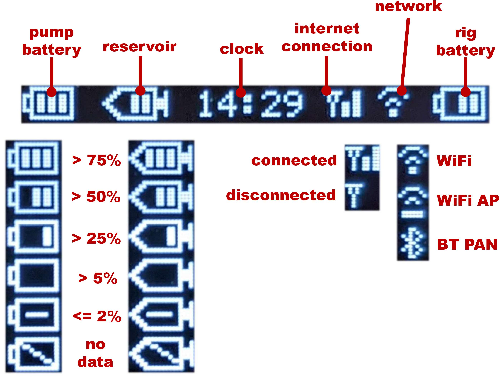
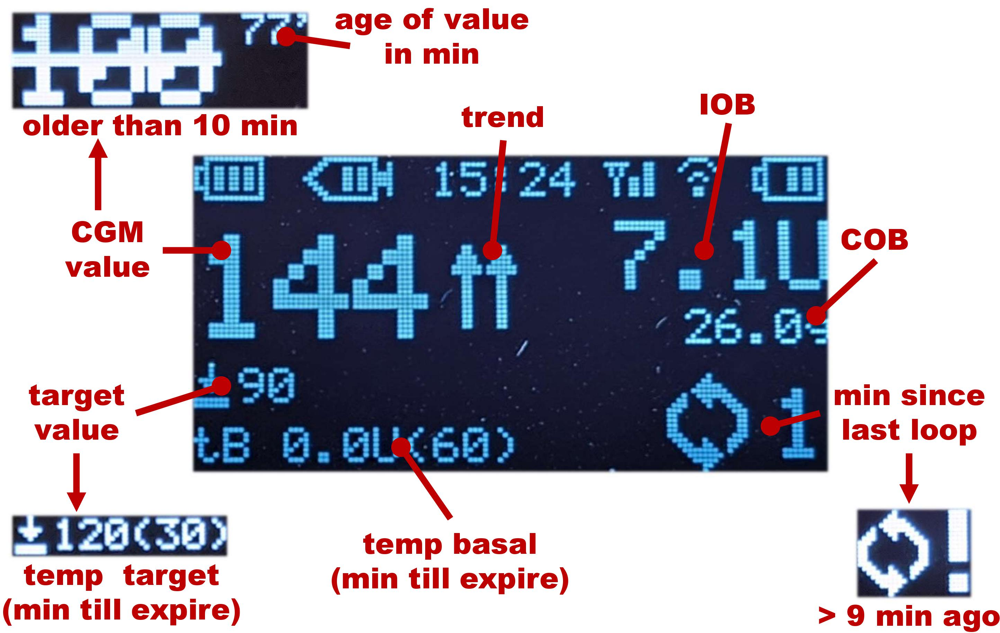
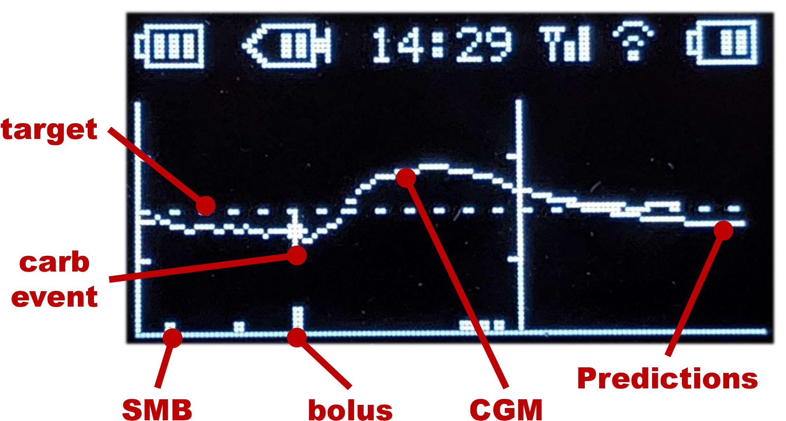
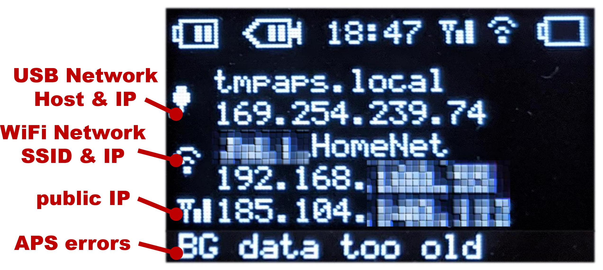
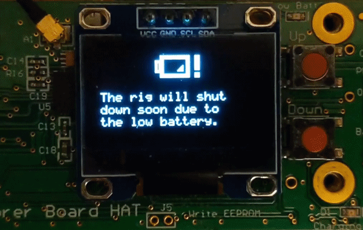

# openaps-menu
This is the repository holding the menu-based software code, which you may choose to add to an Explorer HAT or other screen-based rig (e.g., Adafruit Radiofruit Bonnet) in order to visualize and enter information into a Pi-based #OpenAPS rig.

See [here](https://github.com/EnhancedRadioDevices/Explorer-HAT) for more details on the Explorer HAT hardware. Or [here](https://www.adafruit.com/product/4074) for Adafruit Radiofruit Bonnet.

**NOTE**: You need this code to measure the battery voltage of the rig. For details see below.

## Next UI v1
**NOTE**: The current version is a dev version and may contain bugs. Only Explorer HAT is currently supported. Works with the current (01/2020) dev version of OpenAPS.

This repository contains the new version "Next UI v1" of the openaps-menu software. 
It is a screen-based approach as we know it from medtronic pumps. 
The current implementation has tree screens: 1. "text status", 2. "graph", 3. "system status".
The screens can be scrolled by pressing one of the buttons. 
Each screen has a sub-menu that can be accessed by long pressing the down button.
The screen will turn black after one minute of inactivity.

### Screen scrolling:

### Entering a sub-menu:

## Screens
The current version provides the following screens.

### Symbol Line
Every screen has a symbol line on top. It shows the most important status information of the pump and the rig.

### Text Status
The text status screen aims to provide most necessary information in one compact screen.

### Graph
The graph screen aims to provide relevant data from the near past in a nice looking way.

### System Status
The system status screen aims to provide essential system data in one compact screen.

### Low Battery
The rig shows a blinking low battery screen when the battery is below 5%. If it doesn't blink, the rig is already shut down. When you connect it to power, it will reboot.

## Configuration
The screen system has a default configuration to fulfill at least the same functionality as the openaps-menu v0. Sub-menus can be customized in the files `config/menuAPS.json` (text status, graph) and `menuSystem.json` (system).

### Pump Configs
Basic information about the pump can be configured in `config/pump.json`.

* `"pumpBatteryTypes": []` contains voltage information for different battery types for the pump
* `"pumpBatteryIndex": 0` sets the used battery type for the pump battery icon. Note that it starts with 0
* `"pumpReservoirSize" : 200` defines the no. of insulin units for a full reservoir

## Voltage measurements
The software supports the measurement of the battery voltage by using the script `scripts/getvoltage.sh`.

**NOTE**: This only works with the Explorer HAT.

## ToDo
The software is currently in testing phase. If you find some bugs please report them as github issue! However, there are some more features I want to implement:

* Clean up code base
* Automatic battery detection (detects when pump battery is changed and chooses the correct config)
* BUG: Sometimes the WiFi interface has more than one IP. This screws up the status screen. Find a solution to clean old IPs
* BT PAN never tested
* WiFi Access Point Mode never tested
* Find a Icon for "temp basal"
* Better OpenAPS error messages
